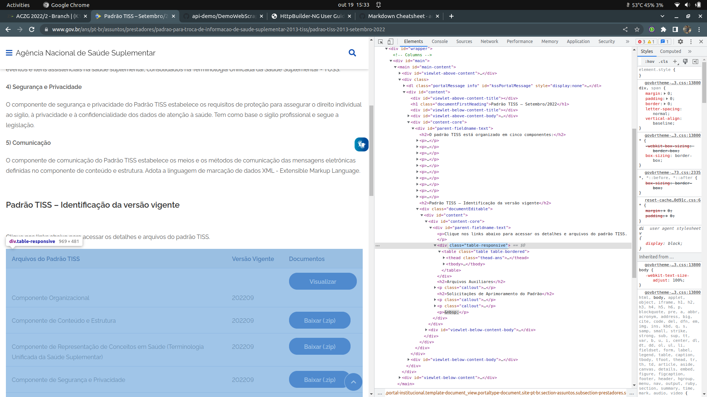
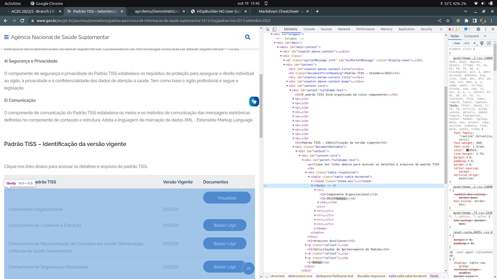
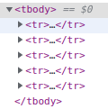

<p align="center">

</p>

# <p align="center">Webscrapping</p>
### <p align="center">Desenvolvido por Gabriel Rezende</p>

## Arquivo main
O arquivo main se econtra no seguinte caminho: __src/main/groovy/WebScraping.groovy__

## Metodologia aplicada: 
Para desenvolver o projeto, me basiei no curso de webscrapping do [Black Lab Tech](https://github.com/felipesilvamelo28/api-demo) que se consiste em: 
1. __Coletar a URL do [site a ser acessado](https://www.gov.br/ans/pt-br/assuntos/prestadores/padrao-para-troca-de-informacao-de-saude-suplementar-2013-tiss/padrao-tiss-2013-setembro-2022).__ 
2. __Conectar ao site e obter uma cópia do HTML da página.__
```groovy
Document htmlpage = Jsoup.connect(url).get()
```
3. __Obter a tabela ou div através de sua classe__
```groovy
//Obtendo a tabela através de sua classe "table table-bordered" conforme imagem abaixo
Element tabela = htmlpage.getElementsByClass("table table-bordered").first()
```

4. __Obter o corpo da tabela através da tag__ 
```groovy
//Obter o corpo da tabela através de sua tag "tbody" conforme a imagem abaixo
Element body = tabela.getElementsByTag("tbody").first()
```

5. __Criar uma lista de todos os elementos do tobdy obtido__
```groovy
//Criar uma lista de Element com todos os elementos com a tag "tr" contidos na tag "tbody", conforme imagem abaixo
List<Element> elementos = body.getElementsByTag("tr")
```
<br>
Assim, criando uma lista com a seguinte estrutura:
```html
<tr>
    <td>Componente de Comunicação</td>
    <td>04.01.00 e 01.04.00</td>
    <td><a target="_self" title="" data-tippreview-image="" href="https://www.gov.br/ans/pt-br/arquivos/assuntos/prestadores/padrao-para-troca-de-informacao-de-saude-suplementar-tiss/padrao-tiss/PadroTISSComunicao202209.zip" data-tippreview-title="" data-tippy="" class="btn btn-primary btn-sm center-block internal-link" data-tippreview-enabled="true">Baixar&nbsp;<span class="sr-only">Componente de Comunicação.</span>(.zip)</a></td>
</tr> 
```
6. __Um loop do tipo foreach irá passar por cada elemento de elementos__
```groovy
for (Element element : elementos) {
    ...
}
```
7. __E dentro deste foreach, será feita uma outra lista de elementos determinados pela tag "td" e quando um dado índice dessa tag tiver o valor de "Componente de Comunicação" o sistema irá coletar o link referente ao download do arquivo desejado__

8. __Foi criada uma classe onde o download do arquivo será executado através do seguinte método:__
```groovy
def downloadfile()
    {
        File file = HttpBuilder.configure{
            request.uri = url
        }.get{
            Download.toFile(delegate, new File(filePath))
        } as File
        file.createNewFile()
    }
```
__Onde quando passado o link e o destino do arquivo, será executado o download do arquivo desejado__